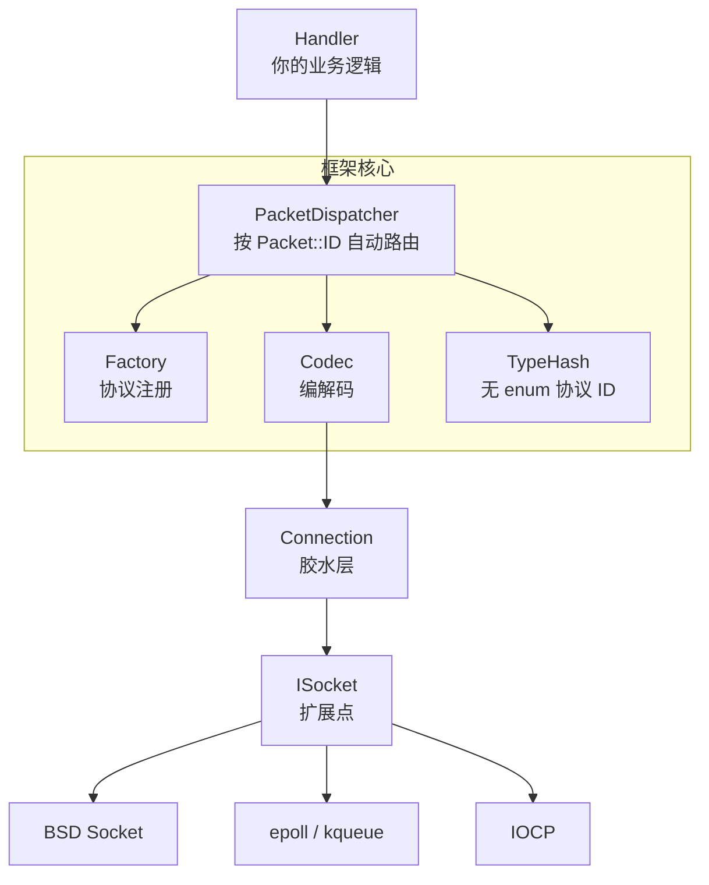
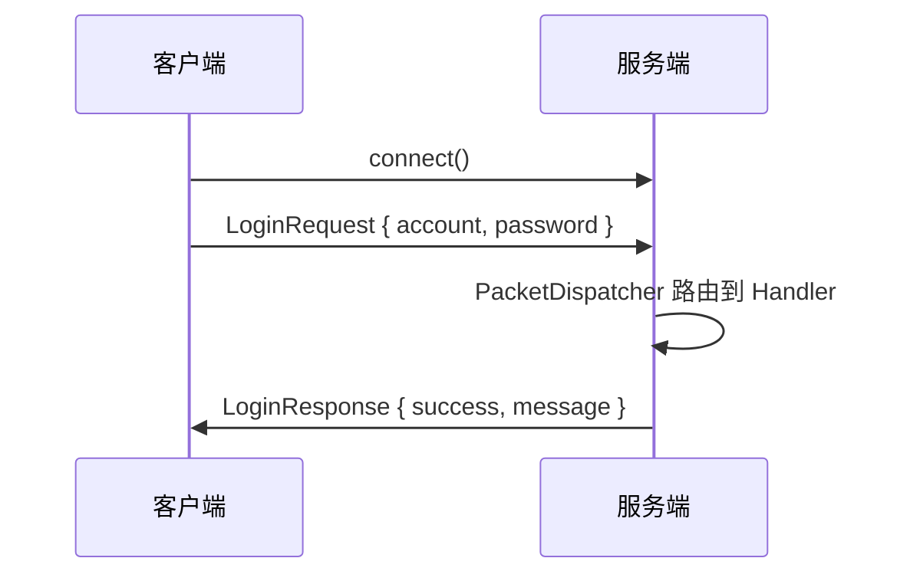

# RealmNet (墟界)

> 可扩展的网络数据包框架

---

## 简介

**RealmNet** 是一个 C++ 网络数据包框架，专注于协议的编解码、分发和管理。通过实现 `ISocket` 接口，可以接入任意 Socket 后端（BSD Socket / epoll / IOCP 等），快速构建网络通信系统。

核心框架在 `realmnet/` 下。根目录 `server/`、`client/` 是基于 BSD Socket 的登录示例。



### 通信流程



---

## 开始

### 编译

要求 CMake 3.20+，C++20。

**MSVC：**
```bash
mkdir build && cd build
cmake .. -G "Visual Studio 17 2022" -A x64
cmake --build . --config Debug
```

**MinGW：**
```bash
mkdir build && cd build
cmake .. -G "MinGW Makefiles" \
  -DCMAKE_C_COMPILER=/path/to/mingw/bin/gcc.exe \
  -DCMAKE_CXX_COMPILER=/path/to/mingw/bin/g++.exe
cmake --build .
```

### 运行

先启服务端，再启客户端：

```bash
./Debug/RealmNetServer.exe   # 服务端
./RealmNetClient.exe         # 客户端
```

---

## 示例

### 定义协议

```cpp
class LoginRequest : public RealmNet::BasePacket
{
    REALMNET_PACKET(LoginRequest)    // 自动生成 type/typeName/ID

    std::string account;
    std::string password;

    void serialize(RealmNet::BinaryWriter& w) const override {
        w.writeString(account);
        w.writeString(password);
    }
    void deserialize(RealmNet::BinaryReader& r) override {
        account = r.readString();
        password = r.readString();
    }
};
REGISTER_PACKET(LoginRequest);
```

### 服务端

```cpp
#include "common/Server.h"
#include "common/Packets.h"

int main()
{
    Server<TcpSocket> server;
    server.setPort(9000);

    // 注册 lambda 处理器，packet 已自动转型为 LoginRequest&
    server.registerHandler<LoginRequest>(
        [](RealmNet::IConnection& conn, LoginRequest& packet) {
            LoginResponse resp;
            resp.success = (packet.password == "123456");
            conn.sendPacket(resp);
        });

    server.start();
}
```

### 客户端

```cpp
#include "common/Client.h"
#include "common/Packets.h"

int main()
{
    Client<TcpSocket> client;

    client.registerHandler<LoginResponse>(
        [](RealmNet::IConnection& conn, LoginResponse& packet) {
            std::cout << packet.message << std::endl;
        });

    client.connect("127.0.0.1", 9000);

    LoginRequest req;
    req.account = "admin";
    req.password = "123456";
    client.send(req);

    client.run();
}
```

---

## 目录结构

```
RealmNet/
├── realmnet/core/          # 框架核心
│   ├── BasePacket.h        # 数据包基类
│   ├── BinaryReader.h/writer.h  # 二进制读写
│   ├── Connection.h        # 胶水层
│   ├── PacketCodec.h       # 编解码
│   ├── PacketDispatcher.h  # 分发器
│   ├── PacketFactory.h     # 工厂
│   ├── PacketRegistrar.h   # 自动注册
│   └── TypeHash.h          # 无 enum 协议 ID
│
├── realmnet/socket/
│   └── ISocket.h           # Socket 抽象接口
│
├── common/                 # 示例代码
│   ├── Packets.h           # 协议定义
│   ├── Server.h            # 服务端封装
│   ├── Client.h            # 客户端封装
│   ├── TcpSocket.h/cpp     # ISocket 的 BSD 实现
│
├── server/main.cpp         # 服务端示例
├── client/main.cpp         # 客户端示例
└── CMakeLists.txt
```

---

## 扩展

接入新后端只需实现 `ISocket`：

```cpp
class MyEpollSocket : public RealmNet::ISocket
{
    bool send(const uint8_t* data, size_t len) override { /* epoll send */ }
    int  recv(uint8_t* buf, size_t len) override      { /* epoll recv */ }
    void close() override                              { /* ... */ }
};
```

然后用 `Server<MyEpollSocket>` 和 `Client<MyEpollSocket>` 即可，无需改动框架。

---

## 许可证

MIT
